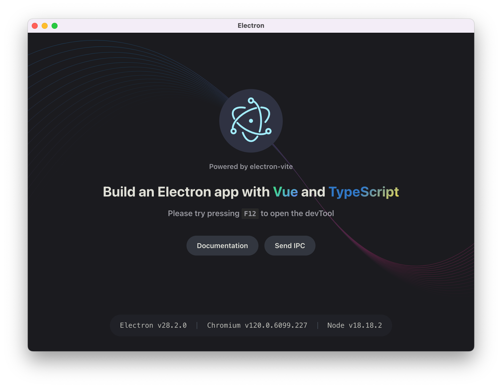

# electron-starter

A ready-to-run starter template for Electron + Vite + Vue 3 + TypeScript.



Features

- Typed IPC helpers between main and renderer (preload exposes a safe API)
- Unified `createWindow` helper for popup positioning (center / corners / bound-based)
- Developer-friendly hot reloading, type checking and example tests

Project layout (short)

- `src/main` - main process code (window management, IPC handlers)
- `src/preload` - preload script (exposes a limited, safe API to renderer)
- `src/renderer` - frontend (Vue + Vite)
- `src/shared` - shared types, zod schemas and IPC type mapping
- `test` - unit / behavior tests

Quick start

```bash
pnpm install
pnpm dev    # development (Electron + Vite HMR)
```

Common scripts (from package.json)

```bash
pnpm dev            # development (electron-vite dev --watch)
pnpm dev:debug      # DEBUG=true ELECTRON_DEBUG=true pnpm dev
pnpm start          # preview (electron-vite preview)
pnpm build          # typecheck then electron-vite build
pnpm run build:mac  # macOS build
pnpm run build:win  # Windows build
pnpm run build:linux# Linux build
pnpm test           # run vitest
pnpm test:watch     # run tests in watch mode
pnpm typecheck      # run node/web type checks
```

IPC and createWindow summary

- Use `window.invoke(channel, payload)` from renderer — the preload exposes typed helpers and `onIpc` for event subscriptions.
- `createWindow` (see `src/main/listener/createWindow.ts`) accepts `WindowOptions`: `windowConfig`, `type`, `bound`, `params`, `hashRoute`. See `docs/createWindow.md` for examples and behavior.

Type & validation

- Zod schemas in `src/shared/schemas.ts` are used as the single source of truth for IPC contracts. Runtime validation runs in the main process and TypeScript types are exported for renderer/preload.

Debug & test

```bash
pnpm dev:debug
pnpm test
```

See the main `README.md` for the Chinese summary and additional links.
